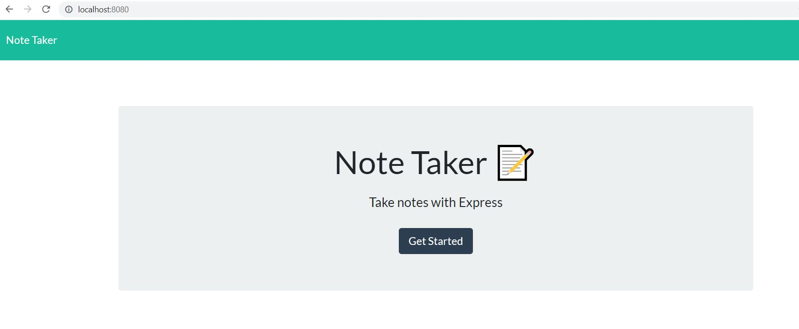
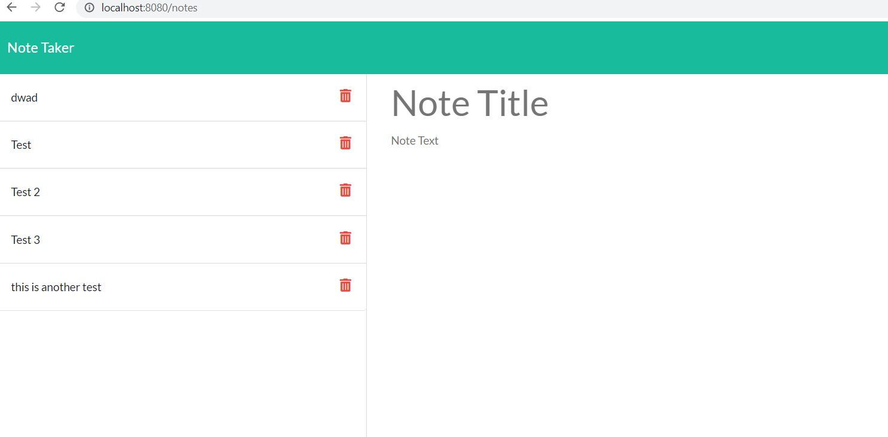
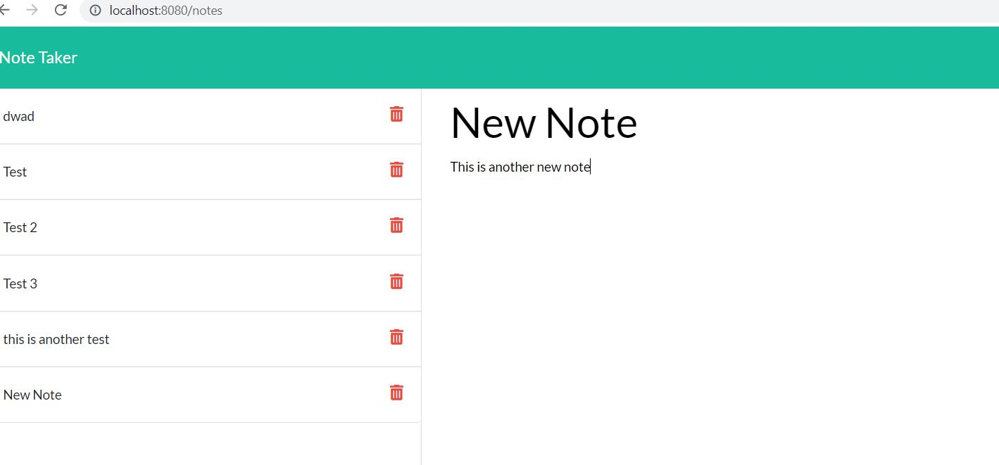
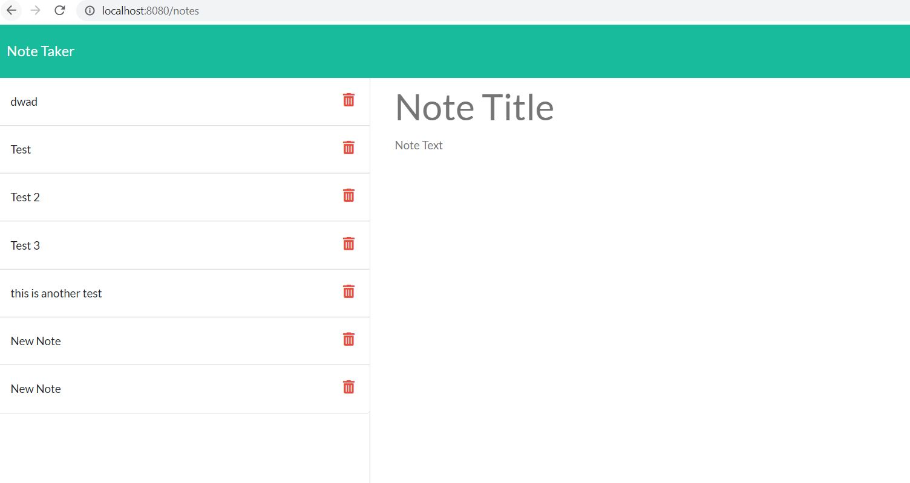

# Note-taker

## Description

A handy note taker that saves all your notes. 

This app uses:
- Javascript
- Express
- JSON
- HTML

## Installation 

To install the notetaker application
- Clone the repo
- Open up your terminal and type "npm install"
- Once the dependencies are installed, in the same terminal type "npm run watch", this starts the server
- Enter the server PORT number in the local host address in your browser OR click on the deployed website link below.

## Usage

- When at the website, click on the "Get Started" button, this opens up the notes page
- On the notes page you can enter your new in the Title and Text sections
- Select the SAVE icon to save your note
- Your new note will appear on the left hand side of the page
- Delete function does not work yet

## Links

Github Repo: https://github.com/DanniWilton/Note-taker 
Heroku Depo: https://secret-shore-49921.herokuapp.com/

## Screen Captures






## User Story

```
AS A small business owner
I WANT to be able to write and save notes
SO THAT I can organize my thoughts and keep track of tasks I need to complete
```


## Acceptance Criteria

```
GIVEN a note-taking application
WHEN I open the Note Taker
THEN I am presented with a landing page with a link to a notes page
WHEN I click on the link to the notes page
THEN I am presented with a page with existing notes listed in the left-hand column, plus empty fields to enter a new note title and the note’s text in the right-hand column
WHEN I enter a new note title and the note’s text
THEN a Save icon appears in the navigation at the top of the page
WHEN I click on the Save icon
THEN the new note I have entered is saved and appears in the left-hand column with the other existing notes
WHEN I click on an existing note in the list in the left-hand column
THEN that note appears in the right-hand column
WHEN I click on the Write icon in the navigation at the top of the page
THEN I am presented with empty fields to enter a new note title and the note’s text in the right-hand column
```